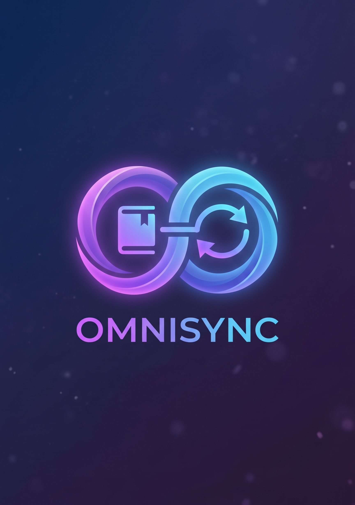
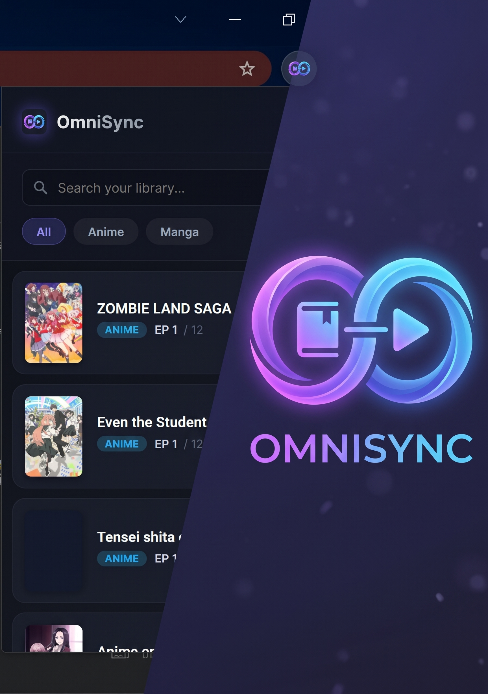

<p align="center">
  
</p>

<h1 align="center">OmniSync</h1>

<p align="center">
  <strong>Your anime & manga progress — synced everywhere, automatically.</strong><br/>
  A Manifest V3 browser extension with a serverless cloud backend.
</p>

<p align="center">
  
  
  
  
  
</p>

<p align="center">
  
</p>

---

## ✨ What is OmniSync?

OmniSync is a **browser extension** that silently watches which anime episode or manga chapter you're reading/watching — and automatically saves your progress to the cloud. No more manually updating your lists. No more forgetting where you left off.

With **AniList OAuth** integration, your progress is also pushed directly to your AniList account in real time.

---

## 🚀 Features

| Feature | Description |
|---|---|
| 🤖 **Auto-Tracking** | Detects episode/chapter from supported sites via URL & DOM parsing |
| 📺 **80% Watch Rule** | Anime progress only saves after you've watched past 80% — no accidental saves |
| ☁️ **Cloud Sync** | Progress tied to your account; works across all devices |
| 🔗 **AniList Integration** | Login with AniList OAuth or link your existing account to push progress automatically |
| 🔍 **Search & Filter** | Search your library by title; filter by Anime or Manga |
| 🖥️ **Clean Popup UI** | Glassmorphism dark UI with your full watch/read history at a glance |
| 🌐 **Multi-Site Support** | Covers 10+ popular anime & manga streaming/reading sites |

---

## 🌐 Supported Sites

### Anime
| Site | Domain |
|---|---|
| Ylnime | `ylnime.com` |
| AnimeSail | `animesail.xyz` |
| OtakuDesu | `otakudesu.blog` |
| GogoAnime | `gogoanime.com` / `anitaku.to` |
| HStream *(18+)* | `hstream.moe` |
| HAnime *(18+)* | `hanime.tv` |

### Manga
| Site | Domain |
|---|---|
| Komiku | `komiku.id` |
| Shinigami | `11.shinigami.asia` |
| MangaFire | `mangafire.to` |

---

## 🏗️ Architecture

```
┌─────────────────────────────────────────────────────┐
│                  Browser Extension                   │
│                  (Manifest V3)                       │
│                                                      │
│  ┌──────────────┐  ┌──────────────┐  ┌───────────┐ │
│  │ Content      │  │  Background  │  │  Popup    │ │
│  │ Scripts      │→ │  Worker      │→ │  UI       │ │
│  │ (per-site    │  │ (sync trigger│  │ (dashboard│ │
│  │  tracking)   │  │  + auth)     │  │ + auth)   │ │
│  └──────────────┘  └──────┬───────┘  └───────────┘ │
└─────────────────────────────────────────────────────┘
                            │ HTTPS (JWT)
                            ▼
┌─────────────────────────────────────────────────────┐
│               Vercel Serverless API                  │
│                (api.farlabs.my.id)                   │
│                                                      │
│  /api/sync         → Normalize title via AniList     │
│  /api/progress     → Fetch user history              │
│  /api/anilist-auth → OAuth redirect                  │
│  /api/anilist-callback → Token exchange + DB save    │
└──────────────────────────┬──────────────────────────┘
                           │
          ┌────────────────┴────────────────┐
          ▼                                 ▼
┌──────────────────┐             ┌─────────────────────┐
│    Supabase DB   │             │   AniList GraphQL   │
│  (user_progress  │             │   (title matching   │
│   user_profiles) │             │    + progress push) │
└──────────────────┘             └─────────────────────┘
```

---

## 🔐 Authentication

OmniSync supports two sign-in methods:

### 1. Continue with AniList *(Recommended)*
Click **"Continue with AniList"** in the popup → authorize on AniList → done. Your account is created automatically and your progress is linked to your AniList list.

### 2. Email / Password
Create a classic account with email and password. You can link your AniList account later from the dashboard.

---

## 📦 Tech Stack

| Layer | Technology |
|---|---|
| **Extension** | JavaScript (ES2020), HTML5, CSS3 — Manifest V3 |
| **Backend** | Node.js Serverless Functions on Vercel |
| **Database** | Supabase (PostgreSQL with Row Level Security) |
| **Auth** | Supabase Auth + AniList OAuth 2.0 |
| **Metadata** | AniList GraphQL API |
| **Deployment** | Vercel (auto-deploy on push) |

---

## 🛠️ Installation (Manual / Development)

### Prerequisites
- Node.js 18+
- A [Supabase](https://supabase.com) project
- A [Vercel](https://vercel.com) account
- An [AniList Developer Client](https://anilist.co/settings/developer)

### 1. Clone & Install
```bash
git clone https://github.com/Frey210/OmniSync.git
cd OmniSync
npm install
```

### 2. Configure Environment Variables
Copy `.env.example` to `.env` and fill in your credentials:
```env
SUPABASE_URL=https://your-project.supabase.co
SUPABASE_SERVICE_ROLE_KEY=your_service_role_key
ANILIST_CLIENT_ID=your_anilist_client_id
ANILIST_CLIENT_SECRET=your_anilist_client_secret
ANILIST_REDIRECT_URI=https://your-api-domain.com/api/anilist-callback
```

### 3. Set Up Supabase Database
Run this in your Supabase **SQL Editor**:
```sql
-- User progress tracking
CREATE TABLE IF NOT EXISTS user_progress (
  id UUID PRIMARY KEY DEFAULT gen_random_uuid(),
  user_id UUID REFERENCES auth.users(id) ON DELETE CASCADE,
  media_id INT,
  anilist_id INT,
  canonical_title TEXT,
  type TEXT CHECK (type IN ('anime', 'manga')),
  episode INT,
  chapter INT,
  source_url TEXT,
  cover_image TEXT,
  updated_at TIMESTAMPTZ DEFAULT now(),
  UNIQUE(user_id, anilist_id),
  UNIQUE(user_id, canonical_title)
);

-- AniList OAuth token storage
CREATE TABLE IF NOT EXISTS user_profiles (
  user_id UUID PRIMARY KEY REFERENCES auth.users(id) ON DELETE CASCADE,
  anilist_token TEXT,
  anilist_username TEXT,
  created_at TIMESTAMPTZ DEFAULT now()
);

-- Enable Row Level Security
ALTER TABLE user_progress ENABLE ROW LEVEL SECURITY;
ALTER TABLE user_profiles ENABLE ROW LEVEL SECURITY;

CREATE POLICY "Users manage own progress" ON user_progress
  FOR ALL USING (auth.uid() = user_id);

CREATE POLICY "Users manage own profile" ON user_profiles
  FOR ALL USING (auth.uid() = user_id);
```

### 4. Deploy Backend to Vercel
```bash
npx vercel --prod
```
Set the same environment variables in your Vercel project dashboard.

### 5. Load the Extension
1. Open Chrome → `chrome://extensions`
2. Enable **Developer Mode**
3. Click **Load unpacked**
4. Select the `extension/` folder

---

## 📁 Project Structure

```
OmniSync/
├── api/                        # Vercel Serverless Functions
│   ├── sync.js                 # Core sync endpoint (title match + DB upsert)
│   ├── progress.js             # Fetch user's progress history
│   ├── search.js               # Search media library
│   ├── delete.js               # Delete a progress entry
│   ├── anilist-auth.js         # OAuth redirect initiator
│   ├── anilist-callback.js     # OAuth token exchange + session
│   └── anilist-status.js       # Check linked AniList account
│
├── extension/
│   ├── manifest.json           # Extension config (MV3)
│   ├── background.js           # Service worker (sync + session bridge)
│   ├── popup/
│   │   ├── popup.html          # Extension popup UI
│   │   ├── popup.js            # Popup logic
│   │   └── popup.css           # Popup styles
│   ├── content/
│   │   ├── anime-tracker.js    # Anime site content script
│   │   ├── manga-tracker.js    # Manga site content script
│   │   └── auth-callback.js    # AniList OAuth session bridge
│   └── utils/
│       ├── api.js              # API call helpers
│       ├── auth.js             # Supabase session management
│       └── patterns.js         # Site-specific URL/DOM patterns
│
├── extension/Asset/            # Brand assets
├── .env.example                # Environment variable template
├── vercel.json                 # Vercel routing config
└── PRD.md                      # Product Requirements Document
```

---

## 🗺️ Roadmap

- [x] Multi-site anime tracking with 80% watch threshold
- [x] Manga chapter tracking
- [x] Cloud sync via Supabase
- [x] AniList OAuth login & account linking
- [x] Auto-push progress to AniList
- [ ] Firefox support
- [ ] MyAnimeList integration
- [ ] Browser notification on sync success
- [ ] Statistics dashboard (watch time, streak)

---

## 🤝 Contributing

Pull requests are welcome! For major changes, open an issue first to discuss what you'd like to change.

1. Fork the repo
2. Create your branch: `git checkout -b feat/my-feature`
3. Commit your changes: `git commit -m 'feat: add my feature'`
4. Push: `git push origin feat/my-feature`
5. Open a Pull Request

---

## 📄 License

[MIT](LICENSE) © 2024 Fariz Achmad Faizal

---

<p align="center">
  Made with ❤️ for the anime community<br/>
  <a href="https://github.com/Frey210/OmniSync/releases">Download Latest Release</a> ·
  <a href="https://github.com/Frey210/OmniSync/issues">Report Bug</a> ·
  <a href="https://github.com/Frey210/OmniSync/issues">Request Feature</a>
</p>
